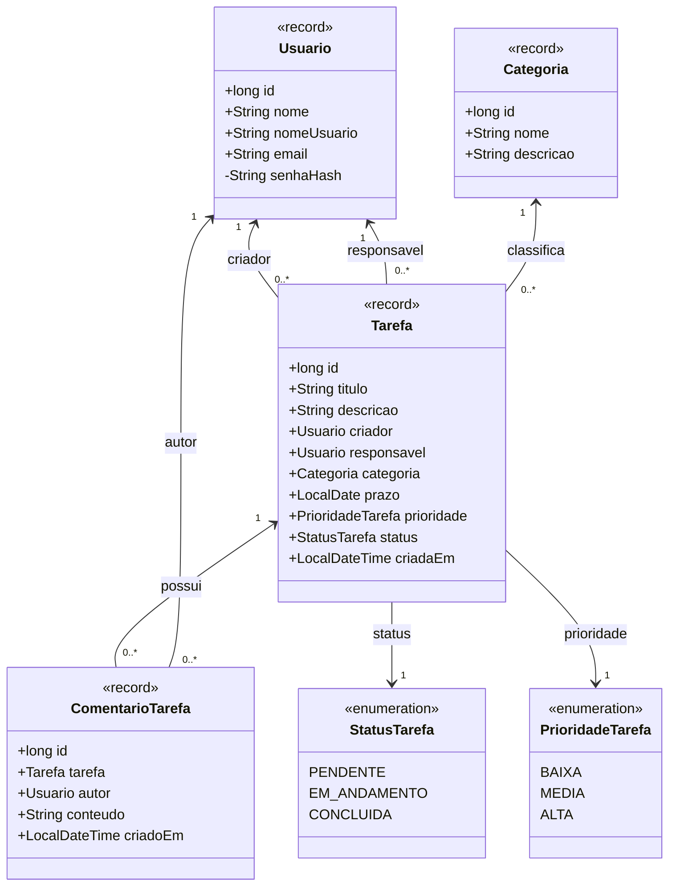
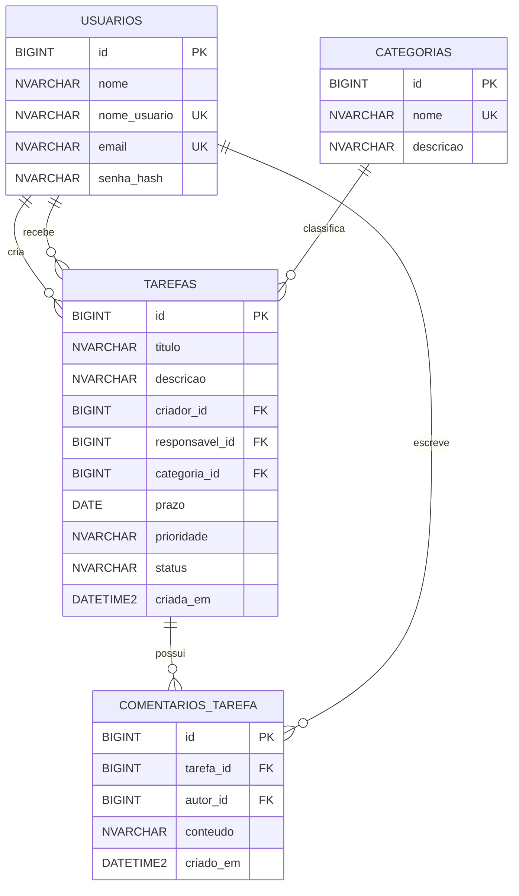

# Etapa 1 atualizada — Gerenciamento de Tarefas

## Tema e escopo

Aplicação desktop Java Swing para autenticar usuários, criar e atribuir tarefas, organizar tarefas por categoria e registrar comentários. Este documento descreve o **modelo alvo** da ampliação para quatro tabelas. As novas funções e tabelas ainda não foram implementadas no aplicativo.

## Suposições adotadas

- Toda tarefa pertence a exatamente uma categoria. A categoria **Geral** será criada na migração e atribuída às tarefas existentes.
- Usuários autenticados podem cadastrar e editar categorias. A exclusão será permitida apenas para categorias sem tarefas; **Geral** não poderá ser excluída.
- Criador e responsável podem ler e publicar comentários na tarefa. O autor pode excluir o próprio comentário. Ao excluir uma tarefa, seus comentários são excluídos com ela.
- Os valores de status e prioridade continuam como enumerações Java e campos com `CHECK` no SQL Server. Eles não são tabelas adicionais.

## Protótipos de telas

| Tela | Objetivo e ações principais | Componentes novos ou relevantes |
|---|---|---|
| Login | Entrar ou abrir o cadastro de usuário | Usuário/e-mail, senha, erro de credenciais |
| Cadastro de usuário | Criar conta | Nome, usuário, e-mail, senha e confirmação |
| Principal | Navegar e iniciar cadastro de tarefa | Acesso a tarefas recebidas, criadas e categorias |
| Listagem de tarefas | Consultar tarefas e abrir seus detalhes | `JTable` com título, categoria, responsável, criador, prazo, prioridade, status e ações |
| Cadastro/edição de tarefa | Criar, atribuir ou editar tarefa | Título, descrição, responsável, **categoria**, prazo, prioridade e status |
| Gerenciamento de categorias | Listar, cadastrar, editar e excluir categorias sem tarefas | `JTable`, campos nome e descrição, ações de salvar/cancelar/excluir |
| Detalhes e comentários | Ler a tarefa e manter sua conversa | Dados da tarefa, lista de comentários, texto e botão Publicar |

As imagens estão em `Mockups/01-login.svg` a `Mockups/07-detalhes-comentarios.svg` na pasta do projeto. Os novos arquivos são `06-gerenciamento-categorias.svg` e `07-detalhes-comentarios.svg`.

### Fluxo de navegação

```text
Login → Cadastro de usuário → Login
Login → Principal
Principal → Tarefas recebidas/criadas → Listagem → Detalhes e comentários
Principal → Nova tarefa → Cadastro/edição de tarefa → Listagem
Principal → Categorias → Gerenciamento de categorias
Listagem → Edição/exclusão de tarefa
Qualquer tela principal → Logout → Login
```

## Entidades e classes

| Classe | Atributos principais | Papel |
|---|---|---|
| `Usuario` | `id: long`, `nome: String`, `nomeUsuario: String`, `email: String`, `senhaHash: String` | Autenticação; cria e recebe tarefas; escreve comentários |
| `Categoria` | `id: long`, `nome: String`, `descricao: String` | Classifica tarefas |
| `Tarefa` | `id: long`, `titulo: String`, `descricao: String`, `criador: Usuario`, `responsavel: Usuario`, `categoria: Categoria`, `prazo: LocalDate`, `prioridade: PrioridadeTarefa`, `status: StatusTarefa`, `criadaEm: LocalDateTime` | Trabalho atribuído e acompanhado |
| `ComentarioTarefa` | `id: long`, `tarefa: Tarefa`, `autor: Usuario`, `conteudo: String`, `criadoEm: LocalDateTime` | Mensagem vinculada a tarefa e autor |
| `StatusTarefa` | `PENDENTE`, `EM_ANDAMENTO`, `CONCLUIDA` | Enumeração |
| `PrioridadeTarefa` | `BAIXA`, `MEDIA`, `ALTA` | Enumeração |

As entidades são projetadas como `record` Java com acessores gerados. Validação, permissões e operações de cadastro/edição ficam em serviços e controllers. Isso corrige a divergência do UML anterior, que atribuía métodos às entidades sem correspondência no código.

### Diagrama de classes editável



## Modelo Entidade-Relacionamento

| Tabela | Campos e tipos SQL Server | Chaves e restrições |
|---|---|---|
| `usuarios` | `id BIGINT`, `nome NVARCHAR(120)`, `nome_usuario NVARCHAR(60)`, `email NVARCHAR(180)`, `senha_hash NVARCHAR(300)` | `id` PK; nome/usuário/e-mail/hash obrigatórios; usuário e e-mail únicos |
| `categorias` | `id BIGINT`, `nome NVARCHAR(80)`, `descricao NVARCHAR(255)` | `id` PK; nome obrigatório e único; descrição opcional |
| `tarefas` | `id BIGINT`, `titulo NVARCHAR(180)`, `descricao NVARCHAR(MAX)`, `criador_id BIGINT`, `responsavel_id BIGINT`, `categoria_id BIGINT`, `prazo DATE`, `prioridade NVARCHAR(10)`, `status NVARCHAR(20)`, `criada_em DATETIME2(0)` | `id` PK; três FKs obrigatórias; demais campos obrigatórios; `CHECK` para prioridade/status; status inicial `PENDENTE` |
| `comentarios_tarefa` | `id BIGINT`, `tarefa_id BIGINT`, `autor_id BIGINT`, `conteudo NVARCHAR(2000)`, `criado_em DATETIME2(0)` | `id` PK; duas FKs obrigatórias; conteúdo e data obrigatórios |

### Diagrama MER editável



## Validação de consistência

| Requisito | Interface | Classe | Tabela |
|---|---|---|---|
| Login/cadastro de usuário | Login e cadastro | `Usuario` | `usuarios` |
| Criar/atribuir/editar tarefa | Formulário e listagem | `Tarefa` | `tarefas` |
| Classificar tarefa | Categoria no formulário; gestão de categorias | `Categoria`, `Tarefa` | `categorias`, `tarefas.categoria_id` |
| Comentar tarefa | Detalhes e comentários | `ComentarioTarefa` | `comentarios_tarefa` |
| Status/prioridade | Formulário e listagem | Duas enumerações | Colunas com `CHECK` em `tarefas` |

Total planejado: **quatro tabelas manipuladas pela aplicação**. O próximo passo é implementar uma migração SQL Server que preserve os dados existentes e torne esse modelo real.
